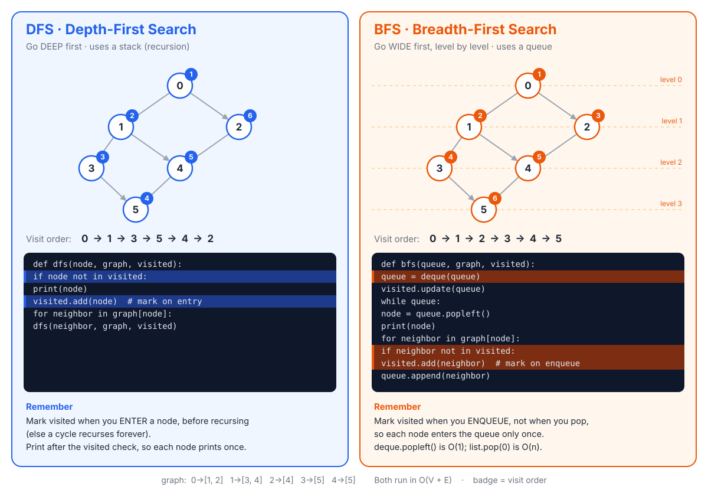

# Images

Cheat-sheet images and the code each one illustrates.

| Image | Shows | Code it illustrates | Generator |
|---|---|---|---|
| [dfs_bfs.svg](dfs_bfs.svg) | DFS and BFS side by side: graph with visit order, code, key rules | `graph`, `dfs()`, `bfs()` in [graph/traversal_list.py](../graph/traversal_list.py) | [generate_traversal.py](generate_traversal.py) |



## Updating after a code change

Images are generated, so don't edit the `.svg` by hand.

1. Open the generator listed in the table.
2. Update the constants at the top so they match the code:
   - `GRAPH`: the `graph` dict
   - `DFS_CODE` / `BFS_CODE`: the function bodies
   - `DFS_HIGHLIGHT` / `BFS_HIGHLIGHT`: which code lines (1-based) get highlighted
   - `DFS_ORDER` / `BFS_ORDER`: the printed output from node 0 (run `python3 graph/traversal_list.py` to get it)
   - `DFS_RULES` / `BFS_RULES`: the "Remember" notes
   - `POS`: node positions, if you add or remove nodes
3. Regenerate from the project root:

   ```sh
   python3 images/generate_traversal.py
   ```

When you add a new image, add a row to the table above.
